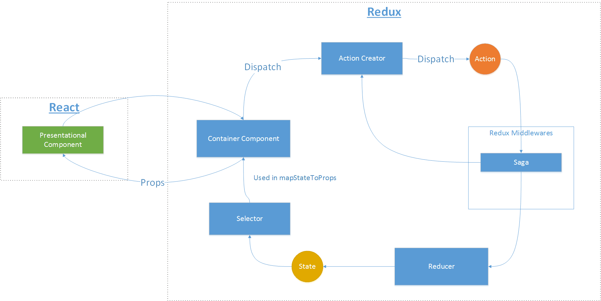

# 新爱工作 基础架构

新爱工作基础架构设计文档 基于 [前端架构](https://www.mindmeister.com/856040163) 思维导图编写

## 目录
- [语言](#语言)
- [技术栈](#技术栈)
- [编程思想](#编程思想)
- [文件组织结构](#文件组织结构)
- [脚本命令](#脚本命令)
- [动态加载](#动态加载)
  - [动态加载Reducer](#动态加载Reducer)
  - [动态加载Saga](#动态加载Saga)
- [设计模式](#设计模式)
  - [Container and Presentational Pattern](#Container and Presentational Pattern)
  - [数据流](#数据流)
- [架构的可扩展性](#架构的可扩展性)
  
## 语言
* [HTML5](https://www.w3schools.com/html/html5_intro.asp)
* [CSS3](https://www.w3schools.com/css/css3_intro.asp)
* [ES6](https://github.com/lukehoban/es6features#readme)

## 技术栈
* [react](https://github.com/facebook/react)
* [redux](https://github.com/rackt/redux)
* [redux-saga](https://github.com/redux-saga/redux-saga)
* [react-redux](https://github.com/reactjs/react-redux)
* [react-router](https://github.com/rackt/react-router)
* [react-router-redux](https://github.com/reactjs/react-router-redux)
* [webpack](https://github.com/webpack/webpack)
* [babel](https://github.com/babel/babel)
* [eslint](http://eslint.org)
* [jest](https://github.com/facebook/jest)

## 编程思想
* [函数式 编程](https://en.wikipedia.org/wiki/Functional_programming)
* [React 编程](https://facebook.github.io/react/docs/thinking-in-react.html)
* [Redux 编程](http://redux.js.org/docs/introduction/ThreePrinciples.html)
* [Redux-Saga 编程](https://redux-saga.github.io/redux-saga/docs/ExternalResources.html)

## 文件组织结构


当前文件目录结构

```
.
├── build                           # 编译输出文件
├── config                          # 基于 Create-React-App 配置文件
├── coverage                        # 代码覆盖率文件
├── docs                            # 架构与开发文档
├── node_modules                    # 依赖包
├── public                          # 编译基础文件
│   ├── index.html                  # 固定首页模板
│   └── favicon.ico                 # 网站App 图标
├── script                          # 基于 Create-React-App 脚本文件
├── src                             # Application source code
│   ├── __test__                    # 根目录下 reducers/routes/store 测试文件 
│   ├── components                  # Presentational Components 目录
│   │   ├── Sample                  # Presentational Components Sample 组件目录
│   │   │   ├── constants.js        # 文本常量 文件
│   │   │   ├── index.jsx           # Presentational Components 文件
│   │   │   └── style.css           # 样式 文件
│   ├── containers                  # Container Components 目录
│   │   ├── SampleContainer         # Container Components SampleContainer 组件目录
│   │   │   ├── __test__            # 组件测试文件
│   │   │   │   ├── actions.test.js # action creator 测试文件
│   │   │   │   ├── reducer.test.js # reducer 测试文件
│   │   │   │   ├── sagas.test.js   # sagas 测试文件
│   │   │   ├── actions.js          # action creator 文件
│   │   │   ├── constants.js        # 文本常量 文件
│   │   │   ├── index.js            # Container Components 文件
│   │   │   ├── reducer.js          # reducer 文件
│   │   │   ├── route.js            # route 文件
│   │   │   └── sagas.js            # sagas 文件
│   ├── images                      # 全局图片
│   ├── request                     # 服务访问层
│   ├── styles                      # 全局样式
│   ├── utils                       # 工具类
│   │   ├── encryption              # 加密
│   │   ├── storage                 # 浏览器持久化
│   │   └── validation              # 表单验证
│   └── index.jsx                   # 程序入口文件
│   └── reducers.js                 # reducer构造
│   └── routes.js                   # 路由帮助模块
│   └── store.js                    # store构造
└── .editorconfig                   # 编辑器设置文件
└── .eslintignore                   # eslint 配置文件
└── .eslintrc                       # eslint 配置文件
└── .gitignore                      # git 配置文件
└── package.json                    # npm 配置文件
└── README.md                       # 帮助文档文件
```

## 脚本命令

|`npm run <script>`|描述|
|------------------|-----------|
|`start`|在本地启动程序 (参考 Create-React-App)|
|`build`|构建程序(参考 Create-React-App)|
|`test`|执行测试|
|`test:coverage`|执行测试并输出覆盖率报告|
|`lint`|检查 JS 代码规范|
|`lint:fix`|检查 JS 代码规范并自动修复|


## 动态加载
我们架构采用根据路由动态加载reducer与saga的技术，相关技术文档参考如下
- [Dynamic Routing](https://github.com/ReactTraining/react-router/blob/v3/docs/guides/DynamicRouting.md)
- [Routing via react-router and react-router-redux](https://github.com/react-boilerplate/react-boilerplate/blob/master/docs/js/routing.md)

## 动态加载Reducer
相关技术文档参考如下
- [injectReducer](https://github.com/react-boilerplate/react-boilerplate/blob/master/docs/js/routing.md)

## 动态加载Saga
相关技术文档参考如下
- [injectSagas](https://github.com/react-boilerplate/react-boilerplate/blob/master/docs/js/redux-saga.md)

## 设计模式

## Container and Presentational Pattern

- Presentational Component 专注于处理展现
- Container Component 专注于处理逻辑

## 数据流



## 架构的可扩展性

- 使用 [reselect](https://github.com/reactjs/reselect) 代替 Selector
