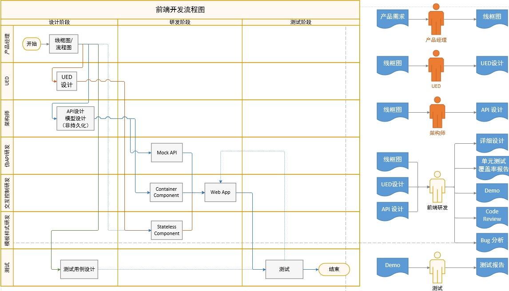

# 新爱工作 开发流程与详细设计规范

新爱工作开发流程与详细设计规范文档 基于 [前端架构，概念，经验与规范](https://www.mindmeister.com/868960548) 思维导图编写

## 目录
- [开发流程](#开发流程)
  - [整体开发流程](#详细设计规范)
  - [详细设计开发流程](#详细设计开发流程)
- [详细设计规范](#详细设计规范)
  - [Mock API 设计](#MockAPI设计)
  - [Stateless Component设计](#StatelessComponent设计)
  - [Container Component设计](#ContainerComponent设计)
    * [Action Creator设计](#ActionCreator设计)
    * [Constants设计](#Constants设计)
    * [Component设计](#Component设计)
    * [Reducer设计](#Reducer设计)
    * [Route设计](#Route设计)
    * [Saga设计](#Saga设计)

## 开发流程

## 整体开发流程


## 详细设计开发流程
- 编写 action/action creator
- 编写 saga 分发与处理 异步操作
- 编写 组件 reducer 返回 新状态（state）
- 设计 状态（state）和数据 的结构
- 编写 组件 该组件 分发 第一步 的 action
- 连接 组件 与 store 订阅变化

## 详细设计规范

## MockAPI设计

我们使用 [mockapi说明.xlsx](http://192.168.1.173/WFDEV/NAGZ_Sagittarius/blob/master/doc/mockapi%E8%AF%B4%E6%98%8E.xlsx)
记录 Mock API 详细设计内容，文档中每个 Sheet 格式如下

|列名|描述|
|------------------|-----------|
|`编号`|场景编号|
|`场景描述`|描述前端功能用例场景|
|`URL`|API URL|
|`Method`|REST Method|
|`API输入`|`header` `query` `body` 请求值|
|`API输出`|API 返回值|
|`前端反馈行为`|API返回后前端相应的反馈行为|

## StatelessComponent设计

**Stateless Component 和 Presentational Component 在相关设计文档中表达相同含义**

- Stateless/Presentational Component 专注于处理展现
- Stateless/Presentational Component 不依赖于Redux
- 文件夹目录结构如下
```
│   ├── components                  # Presentational Components 目录
│   │   ├── Sample                  # Presentational Components Sample 组件目录
│   │   │   ├── constants.js        # 文本常量 文件
│   │   │   ├── index.jsx           # Presentational Components 文件
│   │   │   └── style.css           # 样式 文件
```

## ContainerComponent设计

- Container Component 专注于处理行为与逻辑 [ 事件回调，数据处理 ]
- Container Component 可以在其它 Stateless/Presentational Component 中使用
- 文件夹目录结构如下
```
│   ├── containers                  # Container Components 目录
│   │   ├── SampleContainer         # Container Components SampleContainer 组件目录
│   │   │   ├── __test__            # 组件测试文件
│   │   │   │   ├── actions.test.js # action creator 测试文件
│   │   │   │   ├── reducer.test.js # reducer 测试文件
│   │   │   │   ├── sagas.test.js   # sagas 测试文件
│   │   │   ├── actions.js          # action creator 文件
│   │   │   ├── constants.js        # 文本常量 文件
│   │   │   ├── index.js            # Container Components 文件
│   │   │   ├── reducer.js          # reducer 文件
│   │   │   ├── route.js            # route 文件
│   │   │   └── sagas.js            # sagas 文件
```

## ActionCreator设计

- ActionCreator 专注于 Action 的构造
- 构造一个 Plain Object

## Constants设计

- 字符串常量定义

## Component设计

- 将 State 与 Container Component 连接起来
- State 与 Presentational Component Props 的映射 [selector 调用]
- Store Dispatch 与 Presentational Component 回掉 函数 的映射

## Reducer设计

- Reducer Composition [ 参考 Todos and Todo Training Sample ]
- Immutable
- Colocate Selector with Reducer [ State of Selector is consistent with State of Reducer ]

## Route设计

- TBD

## Saga设计

- 常用 Effects

|名称|功能|
|------------------|-----------|
|`put`|Dispatch action|
|`call`|Invoke function or generator|
|`fork`|Start a task running in background with attached forks|
|`spawn`|Start a task running in background with detached forks|
|`race`|Trigger race between multiple effects|
|`take`|Pull action(s) by pattern|
|`takeLatest`|Watch and start single task with preceding cancelled |
|`takeEvery`|Watch and start multiple tasks concurrently|
|`cancel`|Cancel task|
|`cancelled`|Handle cancellation logic|

- 常用 [Recipes](https://redux-saga.github.io/redux-saga/docs/recipes/index.html)
  - `Throttling`
  - `Debouncing`
  - `Retrying XHR calls`
  - `Undo`
